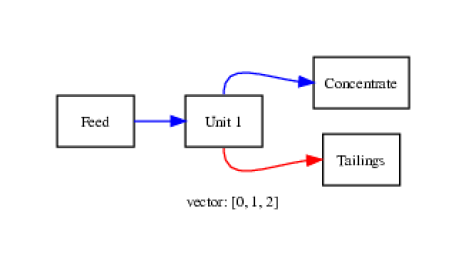
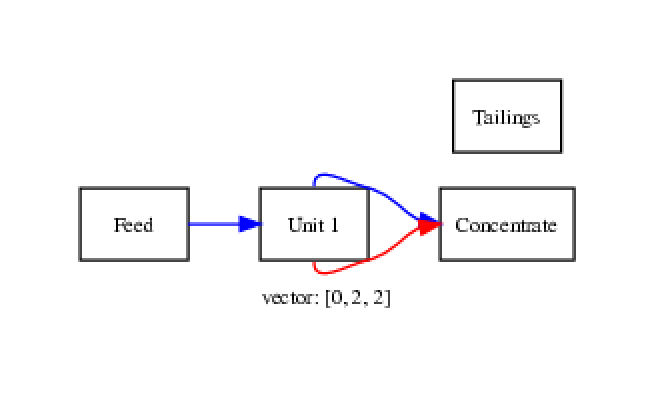

# testing for C++

[jrper.github.io/rv/cpp_testing.html](http://jrper.github.io/rv/cpp_testing.html)

j.percival@imperial.ac.uk


### Stages of python testing

 1. Write tests
 2. Run tests
 3. Observe results


### Stages of C++ testing

 1. Write tests
 2. __Compile tests__
 3. Run tests
 4. Observe results


### C++ Testing frameworks

 - [`googletest` aka `gtest`](https://github.com/google/googletest) from Google
 - [`boost.test`](https://www.boost.org/doc/libs/1_70_0_beta1/libs/test/doc/html/index.html) part of the BOOST libraries
 - [`cppunit`](http://cppunit.sourceforge.net/doc/1.8.0/) Veteran framework, not Windows friendly.
 - *lots* of handbuilt frameworks
 - As usual [wikipedia](https://en.wikipedia.org/wiki/List_of_unit_testing_frameworks#C++) has a table.


### C++ Testing frameworks

Similar structues in multiple frameworks:
 - _`test cases`_ make logical assertions to test code
 - _`test suites`_ collect cases to build executables
 - _`test runners`_ call executables & collate results


### Genetic Algorithm project

Template project repository contains a python-based test runner `run_tests.py`,
with a Makefile (for CX1/travis).

```
make runtests
```

Code will also compile/run on Windows with a suitable visual studio setup.


### Genetic Algorithm project

`run_tests.py` calls executables in `tests/bin` directory, built from `.cpp` files in
`tests`.

If an executable:
 - fails to run
 - has `fail` in its output
 test is logged as failing.


### An example test case

```
    int valid[3] = {0, 1, 2};

    if (Check_Validity(valid))
		std::cout << "pass\n";
	else
		std::cout << "fail\n";
```


### An example test case

In the template repository, this is testing Stephen's stub validity checker:

```
bool Check_Validity(int *circuit_vector)
{
  return true;
}
```

test is on minimum valid circuit:


### An example test case




What about an invalid one?


### Another example test case




### Another example test case

```
	int invalid[3] = {0, 2, 2};

	if (Check_Validity(invalid))
		std::cout << "fail\n";
	else
		std::cout << "pass\n";
```


### The Makefile

Lots of things aren't currently tested (e.g. `mark_unit` function).
You will probably want to add tests/files.

One option is to just add more test cases to existing files:

```
tests/test1.cpp
tests/test2.cpp
```

Easy to add, but may cause conflicts on github.


### The Makefile

Another good option is to have (at least) one test file for each team.
 - Genetic Algorithm 
 - Circuit modelling
 - Validity checking

Also tells you who to talk to:


### The Makefile

Add tests to makefile by copying structure from the lines for `test1` & `test2`

```

TESTS = test1 test2

test1: $(TEST_BIN_DIR)/test1

$(TEST_BIN_DIR)/test1: $(TEST_BUILD_DIR)/test1.o \
                             $(BUILD_DIR)/CCircuit.o
	     $(CXX) -o $@ $^

```
