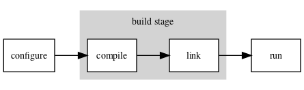
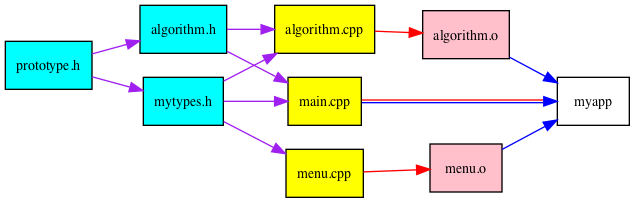

# Make and friends

jrper.github.io/rv/make.html

j.percival@imperial.ac.uk


### The three stages of generating a unix executable from source



 - Configure - find libraries and tools
 - Build - Compile code and link executable
 - Run 


### Configuring - `autotools` & `cmake`

Linux packages often use tools called `cmake` [(www.cmake.org)](www.cmake.org) or `autotools` [(autotools.io)](autotools.io) to deal with finding libraries and file paths.


Installation instructions look something like

```
./configure
make
```

for `autotools` based projects or

```
cmake .
make
```

for `cmake` ones.


### Compiling & Linking

For today we'll concentrate on the build step.

We can "just" call the compiler by hand

```
#include <stdio.h>

int main(int argc, char** argv){
  printf("Hello World!\n");
  return 0;
}
```

```bash
$> cc hello.c -o hello
$> ./hello
Hello World!
$>
```


### The Windows version

On unix-like systems:

- default C compiler is `cc`, C++ compiler is `c++`
- linker is `ld` (can just call compiler)

On Windows:
- Compiler is `cl.exe` for both,
- Linker is `link.exe`.
- Configure `.vcxproj` files with `msbuild.exe` or `devenv.exe`.

See the [Microsoft documentation](https://docs.microsoft.com/en-us/cpp/build/building-on-the-command-line?view=vs-2019) for more.


### Compiling & Linking
Operations get very complicated as you include more compiler options, link to more source files, include more headers from non-standard paths and link to more and more libraries:

```
cxx -DUSE_VTK=1 -I/usr/local/include -I/apps/vtk myfile.cpp \
 myotherfile.cpp another_file.o yetanotherfile.o \
 -O3 -g -ffast-math -lX -lm -L/usr/lib/vtk-5.10 \
 -lvtkCommonCore -lpng -o myfile
```


### Compiling & Linking

Here we're using various compiler options:
- The `-D` sets macros for `#ifdef` etc
- The `-I` adds to the header search path,
- The `-L` adds to the library search path
- The `-O3` specifies maximum compiler optimizations
- The `-g` leaves names for debugging
- The `-lpng` links in the `libpng` library (using the shared `libpng.so` version by default).


### Compiling & Linking



Code units must also be rebuilt _in order_ as their dependencies are updated.

A lot of stuff  to remember. Nicer to automate.


### A shell script version

A halfhearted attempt will put commands in a text file, say `compile.sh`

```
#!/usr/env bash

cxx -DUSE_VTK=1 -I/usr/local/include -I/apps/vtk myfile.cpp \
 myotherfile.cpp another_file.o yetanotherfile.o \
 -O3 -g -ffast-math -lX -lm -L/usr/lib/vtk-5.10 \
 -lvtkCommonCore -lpng -o myfile
 ```

use `chmod u+x compile.sh` one time, then

```
./compile.sh
```


### GNU make
#### A program to build programs

The GNU tool `make` uses recipes from text files, called `Makefile`s to automate and control the build process.

Basic help available at the command line: `make -h`, `man make` or `info make`.


Original `make` was created by Stuart Feldman in April 1976 at Bell Labs.

Windows has its own version called `nmake`

Gnu `make` and windows `nmake` not really very compatible, due to things like `-I` versus `/I`.


_Make originated with a visit from Steve Johnson storming into my office, cursing the Fates that had caused him to waste a morning debugging a correct program (bug had been fixed, file hadn't been compiled, cc *.o was therefore unaffected)._

_As I had spent a part of the previous evening coping with the same disaster on a project I was working on, the idea of a tool to solve it came up._

— Stuart Feldman, The Art of Unix Programming, Eric S. Raymond 2003


### GNU make: A program to build programs

A `Makefile` consists of a list of `target`s, listing the dependency structure, along with recipes to build each target from its prerequisites.


### GNU make: A program to build programs
The general syntax is

```
# Lines starting with # are comments
<target name> : prerequite1 [prerequite2 ...]
	recipe line 1
	[recipe line 2]
	[...]
```

as a trivial example:

```
biscuit:  eggs.cpp flour.cpp sugar.cpp
	$(CXX) eggs.cpp flour.cpp sugar.cpp -o biscuit
```


### GNU make: A program to build programs
Run the command to build the biscuit target as
```
make biscuit
```
(or just `make` to build default target, usually first one)
- By default, recipe lines must start with `tab` characters, NOT spaces.
- Variables are referenced with `$(variable_name)` or `${variable_name}`
- Defaults to run each line in its OWN subshell.


### GNU make: A program to build programs

Can get faster rebuilds by storing intermediate files

```
eggs.o: eggs.cpp
	$(CXX) eggs.cpp -c

flour.o: flour.cpp
	$(CXX) flour.cpp -c

sugar.o: sugar.cpp
	$(CXX) sugar.cpp -c

biscuit:  eggs.o flour.o sugar.o
	$(CXX) eggs.o flour.o sugar.o -o biscuit
```


### GNU make: A program to build programs

Now if we change `flour.cpp`, and run
```
make biscuit
```

- Only the `flour.o` object file will be recompiled.
- The executable `biscuit` is still relinked.


### GNU make: A program to build programs

Make has a _lot_ of default recipes installed with it.

- May or may not do what you wanted.
- Often cause confusion about why things broke.
- If in doubt, we recommend writing things more explicitly.


### Make variables

Make variables can be:

- Set in the Makefile itself as `VARNAME=<value>` (no tabs)
- Set at the command line with `make CXX=icc`
- Inherited from the environment (eg. an earlier `export VARNAME=<value>`)


### Make variables

- Some variables like `${CC}`come with preassigned with default values (usually GNU tools such as gcc).
- Tools like CMake and autotools build up variables to build Makefiles.


### Make functions

As well as variables, `make` has functions.

The syntax is very similar

```
$(<function name> <arg1> [<arg2> ...])
```


To collect a list of all functions ending `.cpp`:

```
SRC_FILES = $(wildcard src/*.cpp)
```

To get a list with the `.cpp`s replaced with `.o`s:
```
OBJ_FILES = $(patsubst %.cpp,%.o,${SRC_FILES})
```


### Common target names

Some target names have become "standard" in Makefiles:

- `all` is usually set to depend on all final outputs (so everything gets built)
- `install` copies files as necessary to install the project
- `clean` deletes any built targets etc.


```
INSTALL_DIR = "${HOME}/bin"

all: myapp mytools;

install:
	cp myapp $(INSTALL_DIR)

clean:
	rm -rf src/*.o myapp mytools
```


### `.PHONY`: Forcing rebuilds

Difficulties if you have a text file called `install` with installation instructions & an `install` target.

Make may think target is up-to-date, so nothing to do.


Fix this by adding a line

```
.PHONY: install
```

Tells `make` that install doesn't really produce output, & should always run.


### Running multiple recipes at once

`make` has an option `-j` to run multiple recipes at the same time.

Eg. to allow up to 4 jobs at once
```
make -j4 all
```
Since targets must wait for their dependencies to be built, this may not speed things up much.


### Using make on the ICL HPC clusters

- On CX1/CX2, load module files _before_ calling `make`.
- Can call `make` inside a `.pbs` script, but don't generally want to run using `mpiexec`.
- Often want a short serial queue.
- If using the `$TMPDIR` variable, remember to copy back/install your output.


```
#PBS -N make_example
#PBS -l walltime=0:30:00
#PBS -l select=1:ncpus=1:mpiprocs=1:mem=1800mb

module load intel-suite
module load mpi
  
export CXX=mpicxx
export CC=mpicc
 
cd mypackage
./configure
make clean
make
```


### Further reading

- A longer tutorial:

[swcarpentry.github.io/make-novice](https://swcarpentry.github.io/make-novice/)

- (too much) documentation:

[www.gnu.org/software/make/manual](https://www.gnu.org/software/make/manual)
