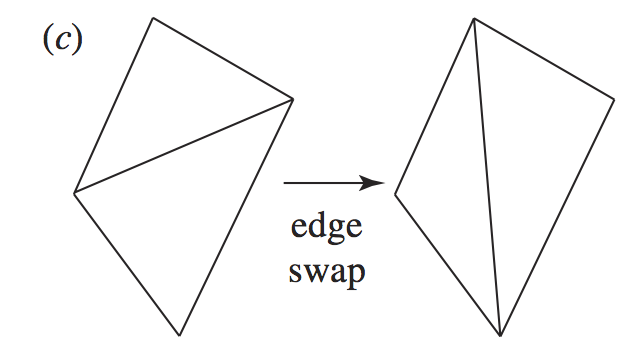
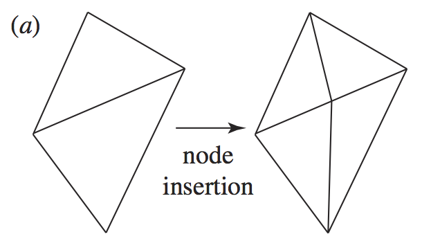
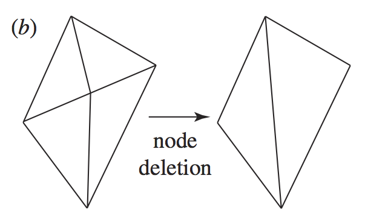
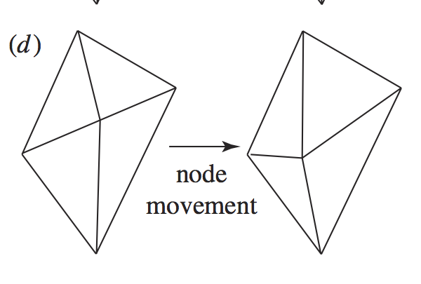
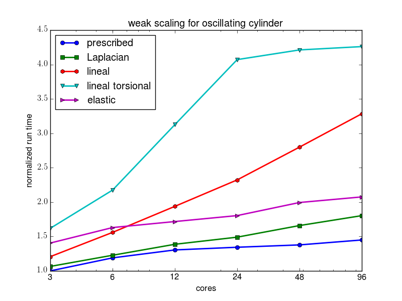

## Coupled hr adaptive and moving mesh methods in environmental fluid dynamics
### James Percival
### AMCG, Imperial College London 
MovingMesh2018, University of Reading, 3rd Sept 2018

## What is Fluidity?

 - Nonhydrostatic Finite Element/Control Volume Navier Stokes solver on unstructured meshes.
 - Extensive (local) mesh adaptivity/optimization.
 - [fluidityproject.github.io](http://fluidityproject.github.io)

## Existing mesh adaptivity

 - Update occurs out-of-timestep
 - Optimize for a "good" mesh
    - Hessian-based error estimate or
	- Goal based
 - New mesh is a "better" representation for static problems/"now".
 - Mesh-to-mesh interpolation [not cheap]

## Mesh Operations : Edge Flips/Edge-Face Flips

 

## Mesh Operations : Edge Flips/Edge-Face Flips

 - Modify connectivity to improve mesh
 - Meet criterion such as Delaunay.
 - Particularly cheap in 2D

## Mesh Operations : Edge Splitting

 

## Mesh Operations : Edge Splitting

 - Increase degrees of freedom
 - Can do mesh interpolation cheaply.

## Mesh Operations : Node Collapsing

 

## Mesh Operations : Node Collapsing

 - Reduce degrees of freedom
 - Diffusive.

## Mesh Operations : Node Movement

## Mesh Operations : Node Movement

 - *r*-adaptivity embeded in mesh optimization
 - mesh interpolation expensive

## Motivation 1: Advection

<video controls preload>
<source src=moving_mesh_etc/comparison.mp4 type="video/mp4">
</video>

## Advection

 - True Lagrangian motion non-diffusive.
 - Useful, but not required.

## Gravity Waves

<video controls>
<source src="./moving_mesh_etc/plucked_string.mp4" type="video/mp4">
</video>

## Motivation 2: Deformation

<video controls>
<source src="./moving_mesh_etc/oscillating_cylinder_viscosity.mp4" type="video/mp4">
</video>

## Deformation

 - Underlying geometry is changing due to other processes
 - Mesh movement absolutely necessary

### Bed Scour/Sediment Transport

Note: ### Ice Melt

## Moving Mesh Formulation

Transform to fixed mesh coordinate, $\boldsymbol{\chi}$, plus moving physical coordinate, $\mathbf{x}$.

$$\dot{\mathbf{x}}(\boldsymbol{\chi})=\mathbf{v}(\boldsymbol{\chi})$$

Consistency demands $\mathbf{v}$ is continuous and piecewise linear to preserve simplices.

## Variable updates

From chain rule:
$$\left.\frac{\partial a}{\partial t}\right|\_{\boldsymbol{\chi}}
=\left.\frac{\partial a}{\partial t}\right|\_{\mathbf{x}}+\mathbf{v}\cdot\nabla_{\mathbf{x}} a.$$

i.e. incompressible N-S eqns look like

$$\left.\frac{\partial \mathbf{u}}{\partial t}\right|\_{\boldsymbol{\chi}}
+(\mathbf{u}-\mathbf{v})\cdot\nabla\_{\mathbf{x}} \mathbf{u}+2\boldsymbol{\Omega}\times\mathbf{u}=-\frac{\nabla\_\mathbf{x} p}{\rho} +\nabla\_\mathbf{x}\cdot\mathbf{\underline{\tau}},$$
$$ \nabla\_\mathbf{x}\cdot\mathbf{u} =0. $$

### Derivative transformations

$$\frac{\partial a}{\partial x\_i} = \sum\_j \frac{\partial \chi_j}{\partial x_i}\frac{\partial a}{\partial \chi\_j}:=\sum\_j\mathcal{J}^{-1}\_{ij}\frac{\partial a}{\partial \chi\_j}$$

## Which mesh velocity?

 A good mesh velocity should:

 - avoid mesh tangling.
 - preserve resolution in boundary layers.
 - track Lagrangian velocity where appropriate.

### Method 1: Laplacian smoothing

 - The engineer's approach
$$ \nabla\_\mathbf{x}\cdot \gamma \nabla\_\mathbf{x} \mathbf{v} = \mathbf{0},\quad
 \mathbf{v}=\mathbf{V}\mbox{ on }\delta\Omega. $$ 
 -  Cheap to calculate
 -  Well behaved in 1D

### Method 2: Lineal Spring Analogy

After Farhat et al(1998). Replace mesh edges with linear springs. Solve equilibrium force balance equation for external loads/forcings.

### Method 3: Linear Elastic Analogy

After Alauzet(2013). Solve explicit PDE on FE mesh.

$$ \sigma(\mathbf{x})=\mathbf{0}. $$
$$ \sigma(\mathbf{x}):=\lambda\nabla\_{\mathbf{x}\_0}\nabla\_{\mathbf{x}\_0}\cdot \mathbf{x}
+\mu\nabla\_{\mathbf{x}\_0}\cdot\left(\nabla\_{\mathbf{x}\_0}\mathbf{x}\+\left(\nabla\_{\mathbf{x}\_0}\mathbf{x}\right)^T\right)$$

### Method 4: Viscous Analogy

$$ \sigma(\mathbf{v})=\mathbf{0}. $$
$$ \sigma(\mathbf{v}):=\lambda\nabla\_\mathbf{x}\nabla\_\mathbf{x}\cdot \mathbf{v}
+\mu\nabla\_\mathbf{x}\cdot\left(\nabla\_\mathbf{x}\mathbf{v}+\left(\nabla\_\mathbf{x}\mathbf{v}\right)^T\right) +\alpha(\mathbf{u}-\mathbf{v}) $$

## Method 5: Lineal- torsional spring analogy

Springs on edges + coil springs on vertices.

### Method Comparison - runtime

### Method Comparison - scaling

### Method Comparison - robustness

 - Laplacian works well for one dimension/small displacement motions, not otherwise.
 - Viscous method resists tangling well, but good mesh not guaranteed. 
 - Lineal-torsional will tend to keep a valid mesh, provided one is possible.

## Coupling moving mesh + hr adaptivity

 - Coupling mesh optimization (especially connectivity) with in-timestep $r$-adaptivity gives best of both worlds.

<!---
Note: Results - Scour
Note: Thankyou for your attention
--->

## References

 - [Piggott et. al (2009)](https://doi.org/10.1098/rsta.2009.0155). Anisotropic mesh adaptivity for multi-scale ocean modelling. *Philosophical Transactions of the Royal Society A*
 - [Farhat et. al (1998)](https://doi.org/10.1016/S0045-7825(98)00016-4) Torsional springs for two-dimensional dynamic unstructured fluid meshes. *Computer Methods in Applied Mechanics and Engineering*
 - [Alauzet (2013)](https://doi.org/10.1007/s00366-013-0340-z) A changing-topology moving mesh technique for large displacements. *Engineering with Computers*
