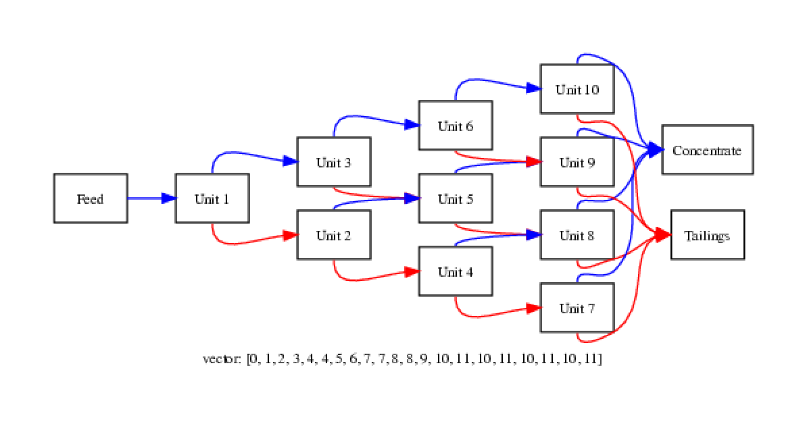

# circuit visualization

j.percival@imperial.ac.uk


### Circuit Encoding


### Circuit Encoding


### Drawing Circuits

Circuits consist of the units and the directed connections between them


Q.v:

 - Flow charts
 - Electrical circuit diagrams
 - Dependency graphs


### Drawing Circuits

Possible free programs for individual diagrams:
 - [dia](http://dia-installer.de/index.html.en)
 - [inkscape](https://inkscape.org/download/)
 - [graphviz](https://graphviz.gitlab.io)


### Circuit visualization

Template project repository contains programmatic circuit plotter using graphviz in `tools` directory

 - python version `plot.py`
 - C/C++ code in `plot.cpp` + Makefile


### Plot.py

```
conda install graphviz python-graphviz
```

```
python plot.py example 0 1 2
```


### Plot.py


### Plot.py

```
python plot.py example 0 2 2
```


### Plot.py

```
python plot.py example 0 1 2 3 4 4 5 6 7 7 8 8 9 \
     10 11 10 11 10 11 10 11
```




### plot.cpp

Requires graphviz development build (library + header files).

Easy on CX1

```
module load graphviz
make plot
```


On Windows, probably easiest to download and build from Graphviz source

 1. Clone the reposity
```
git clone --recurse-submodules \
   https://gitlab.com/graphviz/graphviz.git
```
 2. Add `graphviz\windows\dependencies\graphviz-build-utilities\` to your path

 3. Open `graphviz.sln` in Visual Studio and build X86/Win32 version.
