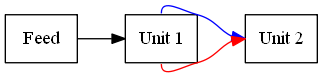

# circuit visualization

[jrper.github.io/rv/seeing_circuits.html](http://jrper.github.io/rv/seeing_circuits.html)

j.percival@imperial.ac.uk


### Circuit Encoding


### Circuit Encoding


### Drawing Circuits

Circuits consist of the units and the directed connections between them


Q.v:

 - Flow charts
 - Electrical circuit diagrams
 - Dependency graphs


### Drawing Circuits

Possible free programs for individual diagrams:
 - [dia](http://dia-installer.de/index.html.en) - draws structured diagrams
 - [inkscape](https://inkscape.org/download/) - vector graphics package
 - [graphviz](https://graphviz.gitlab.io) - directed graph library


### Circuit visualization

Graphviz is low effort to install (for _Python_):

```
conda install graphviz python-graphviz
```

**or** (Mac only via homebrew)

```
brew install graphviz
pip install graphviz
```


### Graphviz

Graphviz Python wrapper builds graph by describing edges

```
import graphviz
graph = graphviz.Digraph()
graph.attr(rankdir='LR')
graph.attr('node', shape='rectangle')
graph.edge('Feed', 'Unit 1', color='black',
            headport='w', tailport='e',
           arrowhead='normal')
graph.edge('Unit 1', 'Unit 2', color='blue',
            headport='w', tailport='n',
           arrowhead='normal')
graph.edge('Unit 1', 'Unit 2', color='red',
            headport='w', tailport='s',
           arrowhead='normal')
graph.render('example', cleanup=True, format='png')
```


### Circuit visualization



See wrapper [documentation](https://pygraphviz.github.io/documentation/stable/tutorial.html#start-up) for more.


### If you somehow get bored.

Using Graphviz in C++ directly requires development build (library + header files).

Easy on CX1

```
module load graphviz
make plot
```


On Windows, probably easiest to download and build from Graphviz source

 1. Clone the reposity
```
git clone --recurse-submodules \
   https://gitlab.com/graphviz/graphviz.git
```
 2. Add `graphviz\windows\dependencies\graphviz-build-utilities\` to your path

 3. Open `graphviz.sln` in Visual Studio and build X86/Win32 version.


 
 ### Good Visualisations

 - Generate lear layout of circuit.
 - Includes information on optimality.
 - Ideally indicate circuit flow data.
