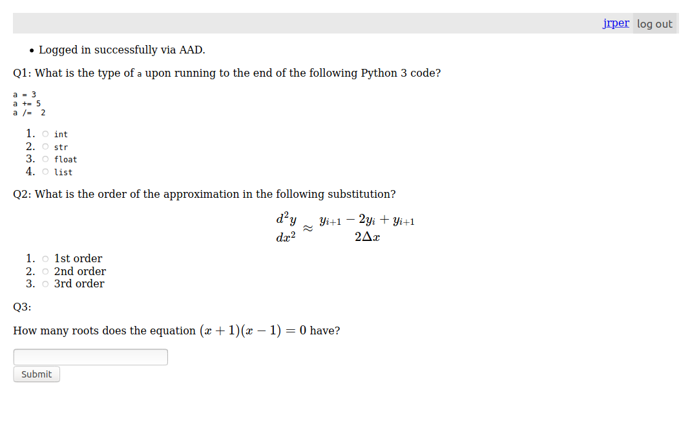
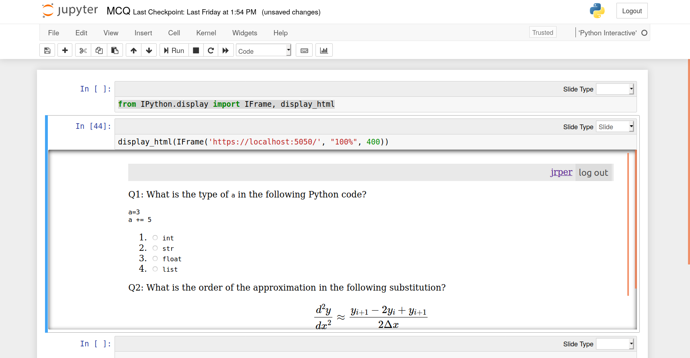

# James Percival

### ACSE RSE TF Presentation

13th February 2020

### Relevant teaching experience

- Devising, presenting & tutoring courses and ancillary material for ACSE MSc course,
   - particularly ACSE 1
   - ACSE 4 - miniprojects
- Devising and marking assessments for the same
- Supervising & managing GTAs for ACSE 1    

### Relevant teaching experience

- Further experience outside ACSE
- Small group lectures & examples classes:
  - including linear algebra
  - optimization/data assimilation
  - PDEs
- Ancillary & ad hoc supervision for Masters and PhDs in ESE.

### Relevant RSE experience

- Multiple version control systems
- Multiple programming languages
  - Python, C/C++, Fortran, Matlab, ...
- Experience in anger with ACSE toolchain
   - Jupyter Notebooks
   - GitHub (including API)
   - Github Classroom
   - Azure Cloud
   

### a better ACSE

Current ACSE course has number of issues

<ul>
<li> personality clashes</li>
<li> heteogeneuos IT</li>
<li> slow feedback</li>
<li> incomplete synergy</li>
<li> bored high achievers</li>
</ul>

<ul>
<li> silent strugglers</li>
<li> intense schedules</li>
<li> lack of trained GTAs</li>
<li> risks of plagarism</li>
<li> attendance</li>

Some from previous decisions/cost of doing business:

<ul>
<li> personality clashes</li>
<li> heteogeneuos IT</li>
<li> slow feedback</li>
<li> incomplete synergy</li>
<li> bored high achievers</li>
</ul>

<ul>
<li> silent strugglers</li>
<li> intense schedules</li>
<li> lack of trained GTAs</li>
<li> risks of plagarism</li>
<li> attendance</li>
</ul>

Some strongly exacerbated by scale:

<ul>
<li>personality clashes</li>
<li>heteogeneuos IT</li>
<li>slow feedback</li>
<li>incomplete synergy</li>
<li>bored high achievers</li>
</ul>

<ul>
<li>silent strugglers</li>
<li>intense schedules</li>
<li>lack of trained GTAs</li>
<li>risks of plagarism</li>
<li>attendance</li>
</ul>

### My answers

- Course belief in automated grading,
   - currently targetted user side
   - for longer assessments.
- Gaps for server side & smaller scope (eq MCQs)
- Gaps for marking assistant tools
   - aids to human feedback rather than automatic
- GTAs could blind mark limited scope material

### Multiple Choice Questions

Plus points:

* Trivial to run from server
* Instant feedback to student and **instructor**
* Versatile (assessed, unassessed feedback, group)
   + also for formative & diagnostic testing
* Can be randomized
* Opportunity for students to analyse data themselves

### Multiple Choice Questions

Negative points:

- Want large question bank
- Tough to produce good distractors
- Difficult to test higher order thinking
- feedback side important

### Multiple Choice Questions

Can be served as web pages (optionally with login)

https://jrperacsemcq.azurewebsites.com
or
http://129.31.136.219/questions

### Multiple Choice Questions

Easy to embed inside a Jupyter notebook

### Assistance to human grading

- Currently leverage Github Classrooms
   - limited & generic
- Opportunities for bespoke tools:
   - specialised plagerism detectors
   - Jupyter code commenting/slicing
   - git/github interfaces
- Systems for GTAs.

### GTA Training

- Important: GTAs are front-line teachers
- Room for more diagnostics
  - links back to MCQs
- Mini-training on tools
- Difficulties with just-in-time materials
  - improving as course matures

###  Thank you
